# Active Directory Attack Lab

**Infrastructure | Threat Detection | Purple Team**

[](https://github.com/dgcyberfolio)
[](https://github.com/dgcyberfolio)
[](https://github.com/dgcyberfolio)
[](https://github.com/dgcyberfolio)

---

## Overview

This lab simulates an enterprise Active Directory environment built from scratch using VirtualBox. The goal was to gain hands-on experience with deploying Windows Server infrastructure, configuring telemetry collection, executing real-world attacks, and detecting that activity using Splunk.

The lab covers the full attack lifecycle — from environment setup and tool configuration to executing a brute force attack and simulating adversary techniques using the MITRE ATT&CK-aligned Atomic Red Team framework.

---

## Objectives

- Build and configure a multi-VM Active Directory environment in VirtualBox
- Install and configure Splunk for centralized log collection from Windows endpoints
- Deploy Sysmon with a community-vetted configuration for enhanced endpoint telemetry
- Execute a brute force attack against an RDP-enabled domain user using Kali Linux
- Detect attack telemetry in Splunk using event IDs 4625 (failed logon) and 4624 (successful logon)
- Install Atomic Red Team and simulate adversary techniques mapped to MITRE ATT&CK
- Identify detection gaps and validate visibility into endpoint activity

---

## Lab Architecture

### Network Diagram

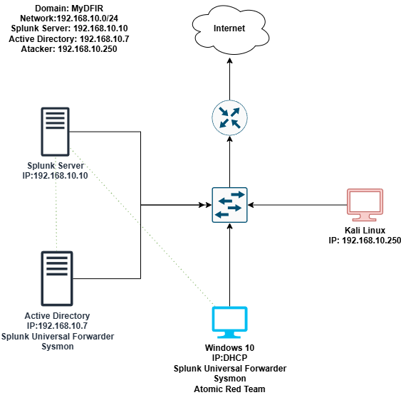

> *Diagram built in draw.io showing all VMs, network connections, and data flow.*

### Network Configuration

| Component | OS | IP Address | Role |
|---|---|---|---|
| Splunk Server | Ubuntu Server 22.04 | 192.168.10.10 | SIEM / Log Collector |
| Active Directory | Windows Server 2022 | 192.168.10.7 | Domain Controller (ADDC01) |
| Target Machine | Windows 10 | DHCP / Static | Endpoint w/ Forwarder + Sysmon |
| Attacker Machine | Kali Linux | 192.168.10.250 | Offensive Operations |

**Domain:** MyDFIR  
**Network:** 192.168.10.0/24

---

## Tools & Technologies

| Tool | Purpose |
|---|---|
| VirtualBox | Virtualization platform |
| Windows Server 2022 | Active Directory Domain Services |
| Windows 10 | Target endpoint |
| Kali Linux | Attacker machine |
| Ubuntu Server 22.04 | Splunk server host |
| Splunk Enterprise | SIEM — log ingestion and analysis |
| Splunk Universal Forwarder | Endpoint log shipping |
| Sysmon (Olaf Config) | Enhanced Windows endpoint telemetry |
| Crowbar | RDP brute force tool |
| Atomic Red Team | MITRE ATT&CK-aligned adversary simulation |

---

## Lab Build — Phase by Phase

### Phase 1 — VM Setup

Four virtual machines were deployed in VirtualBox:

- **Windows 10** — Target machine. Renamed to **Target-PC**. Static IP configured. Splunk Universal Forwarder and Sysmon installed.
- **Windows Server 2022** — Promoted to Domain Controller. Renamed to **ADDC01**. Joined to the **MyDFIR** domain.
- **Kali Linux** — Attacker machine. Static IP set to **192.168.10.250**. Updated and configured with attack tools.
- **Ubuntu Server 22.04** — Splunk server. Splunk Enterprise installed and configured to start on boot.

All VMs were placed on a **NAT Network** within VirtualBox to enable inter-VM communication across the **192.168.10.0/24** subnet.

---

### Phase 2 — Splunk & Sysmon Configuration

**Splunk Server (Ubuntu)**

Splunk Enterprise was installed on the Ubuntu server via the **.deb** package. After installation, Splunk was configured to run at boot under the **splunk** user. The web portal was made accessible on port **8000**.

An index named **endpoint** was created within Splunk to receive Windows telemetry. A receiving port of **9997** was configured to accept forwarded data.

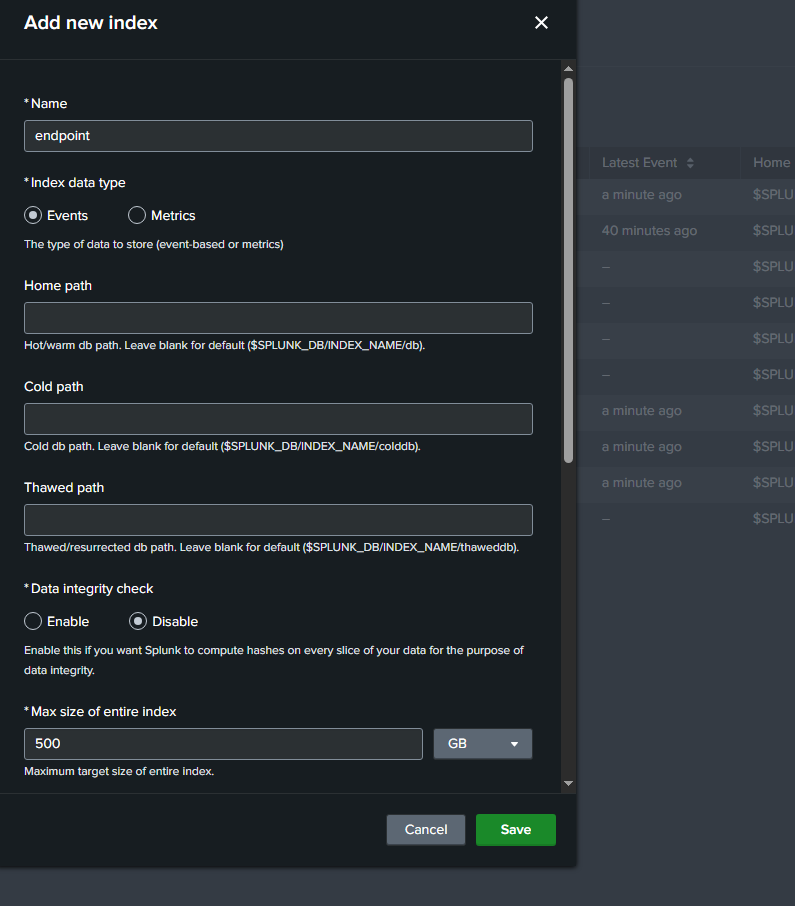

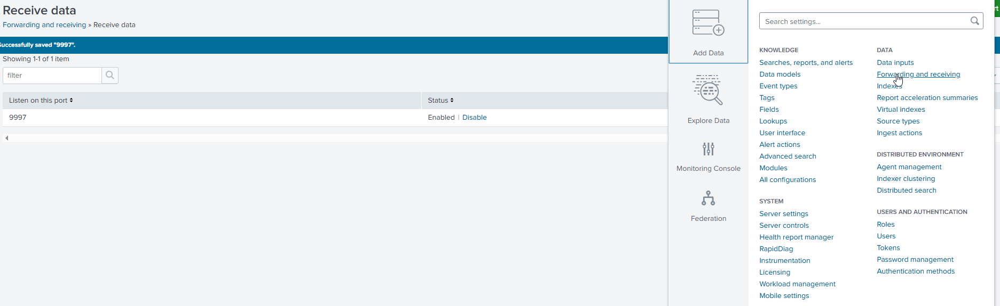

**Splunk Universal Forwarder (Windows Endpoints)**

The Universal Forwarder was installed on both the Target machine and the Active Directory server. A custom **inputs.conf** file was created under the **local** directory (not **default**) to push the following event channels to the **endpoint** index:

- Application
- Security
- System
- Sysmon Operational

The Splunk Forwarder service was configured to run under **Local System** to ensure full log access, and restarted after each **inputs.conf** change.

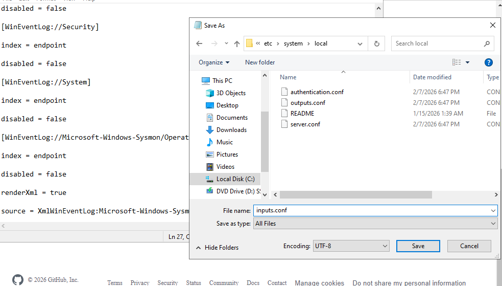

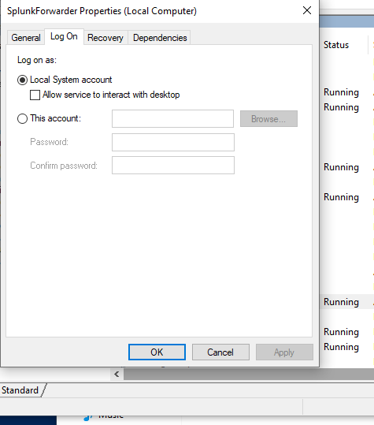

**Sysmon**

Sysmon was installed on the Windows endpoints using the Olaf Hartong community configuration (**sysmonconfig.xml**). This config enhances visibility into process creation, network connections, DNS queries, file creation, and more — all critical for detecting adversary behavior.

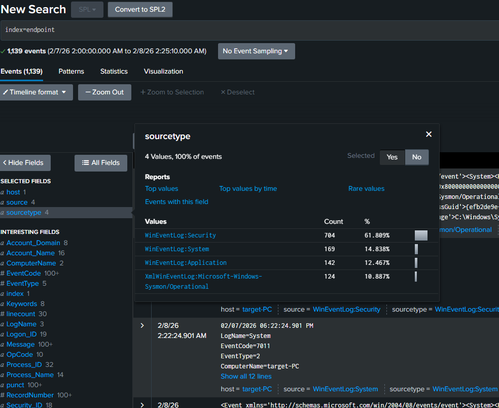

---

### Phase 3 — Active Directory Configuration

Active Directory Domain Services (**AD DS**) was installed on the Windows Server 2022 VM.

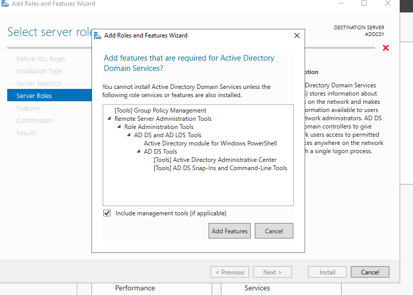

The server was then promoted to a Domain Controller, establishing a new forest with the domain **MyDFIR.local**. The server was renamed **ADDC01** and the Windows 10 Target machine was joined to the domain.

Two domain users were created and added to the domain:

- **Jenny Smith** (J.Smith)
- **Terry Smith** (T.Smith)

Both users were granted RDP access on the Target machine to support the brute force scenario in Phase 4.

---

### Phase 4 — Brute Force Attack (Kali Linux → Target-PC)

**Setup**

On the Windows Target machine, Remote Desktop Protocol (**RDP**) was enabled and both domain users were granted RDP permissions via **Advanced System Settings → Remote → Select Users**.

On Kali Linux, the **crowbar** tool was installed for RDP brute forcing. A wordlist was created from the first 20 lines of **rockyou.txt**, with the known target password appended at the bottom.

**Attack Execution**

```bash
crowbar -b rdp -u T.Smith -C password.txt -s 192.168.10.100/32
```

Crowbar iterated through the password list and returned a successful RDP connection for user **T.Smith**.

---

### Phase 5 — Splunk Detection

After the brute force completed, Splunk was queried to locate the generated telemetry.

**Query:**

```
index=endpoint T.Smith
```

Time range set to last 15 minutes.

**Findings:**

- **Event ID 4625** — 20 failed logon attempts recorded in rapid succession, a clear indicator of brute force activity.
- **Event ID 4624** — 1 successful logon recorded shortly after, confirming credential compromise.

Expanding the **4624** event revealed the source workstation name as **Kali** and the originating IP **192.168.10.250**, directly mapping back to the attacker machine.

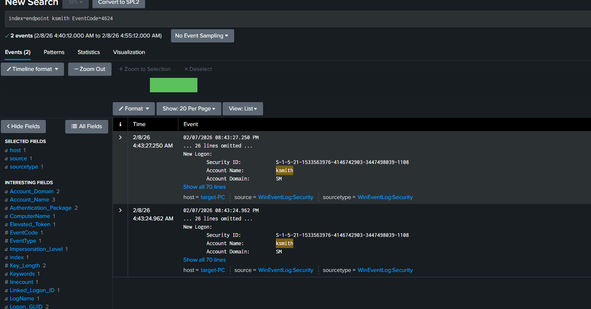

---

### Phase 6 — Atomic Red Team (Adversary Simulation)

**Installation**

On the Target machine, Windows Defender exclusions were added for the entire **C drive** before installation to prevent Atomic Red Team files from being removed. Atomic Red Team was then installed via PowerShell:

```powershell
Set-ExecutionPolicy Bypass -Scope CurrentUser
IEX (IWR 'https://raw.githubusercontent.com/redcanaryco/invoke-atomicredteam/master/install-atomicredteam.ps1' -UseBasicParsing)
```

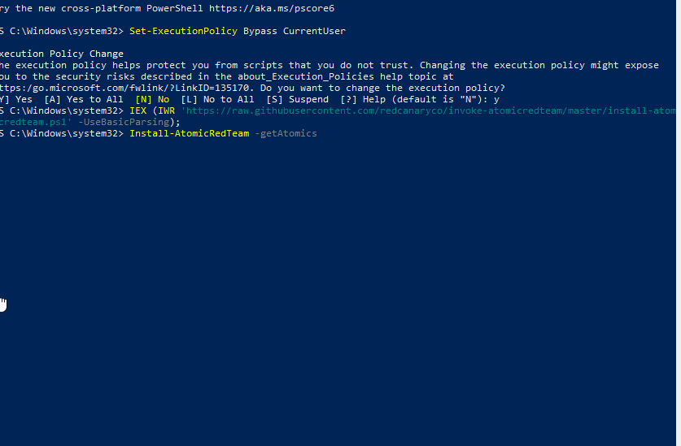

**Technique: T1136.001 — Create Local Account**

```powershell
Invoke-AtomicTest T1136.001
```

A local user account named **NewLocalUser** was created. Initial Splunk search returned no events, revealing a **detection gap** — this activity was not being captured with existing configuration. After a short delay, the event did surface, demonstrating the importance of Sysmon ingestion timing and index configuration.

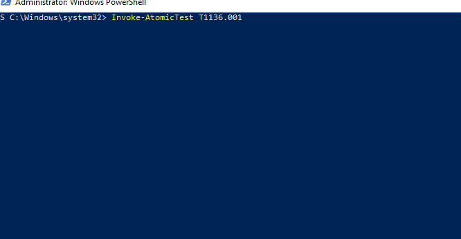

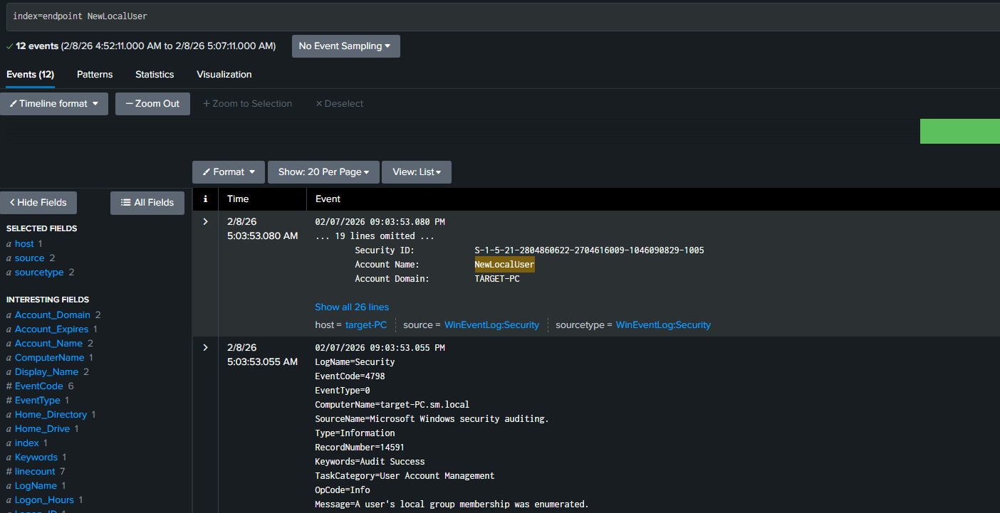

**Technique: T1059.001 — PowerShell**

```powershell
Invoke-AtomicTest T1059.001
```

Windows Defender flagged the technique in real time. Splunk returned a matching event containing the command-line string **exec bypass noprofile**, confirming that alert rules could be built to detect PowerShell execution policy bypass patterns in the environment.

---

## Detection Summary

| Technique | MITRE ID | Event ID | Detection Status |
|---|---|---|---|
| RDP Brute Force | T1110.001 | 4625 (x20), 4624 | Detected |
| Successful RDP Logon | T1078 | 4624 | Detected |
| Create Local Account | T1136.001 | Sysmon EventCode 1 | Delayed — Gap Identified |
| PowerShell Execution | T1059.001 | Sysmon + Defender | Detected |

---

## Key Takeaways

- Splunk is only as useful as the data being sent to it — proper **inputs.conf** configuration and index setup are foundational.
- Sysmon dramatically improves endpoint visibility beyond what native Windows logs provide.
- Atomic Red Team is an excellent tool for identifying detection gaps before an actual attacker does.
- The MITRE ATT&CK framework provides a structured lens for understanding both attacker behavior and defensive coverage.
- Rapid, repeated failed logons followed by a single successful one is a reliable brute force pattern to alert on.

---

## References

- [VirtualBox](https://www.virtualbox.org/)
- [Splunk Enterprise](https://www.splunk.com/)
- [Sysmon — Microsoft Sysinternals](https://learn.microsoft.com/en-us/sysinternals/downloads/sysmon)
- [Olaf Sysmon Config](https://github.com/olafhartong/sysmon-modular)
- [Atomic Red Team](https://github.com/redcanaryco/atomic-red-team)
- [MITRE ATT&CK Framework](https://attack.mitre.org/)
- [Crowbar](https://github.com/galkan/crowbar)

---

*Lab completed as part of my ongoing cybersecurity portfolio. All activity was conducted in an isolated lab environment on machines I own.*
